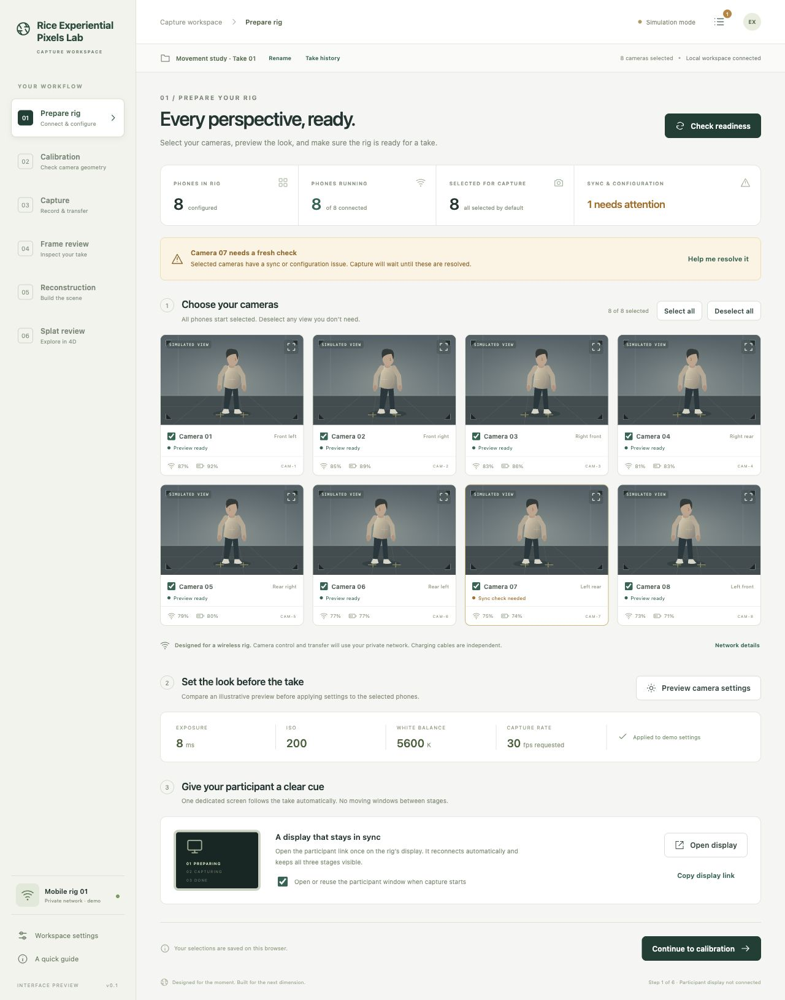

# Rice Experiential Pixels Lab — Multi-Phone-Splat Redesign

A guided interface for a multi-phone 4D capture rig. This first version is a **working UI prototype**: select cameras, preview settings, walk through capture, recover a simulated transfer failure, review frames, and navigate a sample point scene.

**No phone commands, real camera streams, calibration solves, file transfers, or model training run in this version.** The three-stage participant display does work across devices through the local UI server. Illustrative views and results are labeled as simulations.



## Run it on your computer

1. Install Node.js 20 or newer from [nodejs.org](https://nodejs.org/). Restart your terminal after installation.
2. In GitHub Desktop, choose **File → Clone repository → URL**, paste this repository’s URL, and choose a folder.
3. Select the `feature/guided-capture-ui` branch if it has not yet been merged into `main`.
4. Choose **Repository → Open in Terminal** in GitHub Desktop.
5. Run:

   ```sh
   npm start
   ```

6. Open **http://127.0.0.1:4317**. Leave the terminal running. Press **Ctrl+C** in the terminal to stop the server.

There are no packages to install; `npm install` is unnecessary. `node dev-server.mjs` is equivalent to `npm start`. Do not open `index.html` directly: JavaScript modules and the participant relay need the server. Reload the browser after editing a file; this prototype has no build step or automatic reload.

## Try the complete workflow

1. **Prepare rig:** all eight sample cameras start selected. Camera 07 has an amber sync warning. Open its help popup or run **Check readiness**. Try selecting none, then all again.
2. **Camera settings:** adjust exposure, ISO, white balance, and contrast. Compare current and draft views. **Discard** leaves saved values intact; **Apply** updates selected demo cameras and requires another readiness check. The preview approximates the look, not a phone sensor’s actual output.
3. **Calibration:** use the sample rig profile, create a sample profile, or choose COLMAP for geometry later. Board acquisition and solving are not connected.
4. **Capture:** enter a session name, frame count, and requested frame rate; check readiness after edits. Start capture. Preview cards explicitly pause during acquisition. Enable the failure example to try recovering a missing transfer without recapturing.
5. **Frame review:** scrub the common sequence index across cameras. Missing transfers stay distinct from dropped frames. Original capture-report calculations run against generated sample timestamps.
6. **Reconstruction:** choose 3DGS or 4DGS and compatible geometry. An eight-second simulated run creates a saved demo result.
7. **Splat review:** drag to orbit, scroll/pinch to zoom, Shift-drag to pan. Click the canvas and use WASD to move or arrows to orbit. Playback/scrubbing preserves the viewpoint. This is a procedural point scene, not a trained Gaussian splat.

**Activity log** provides severity/camera filters, search, explanations, raw details, resolved states, and JSON export. Scrolling up pauses following new events. **Take history** reopens completed takes; reconstruction results retain their inputs. Settings, up to 30 takes, results, and the last 500 events persist in this browser. They are not shared or backed up to GitHub. **Export session summary** saves a JSON copy, not a media archive.

## Participant display and private-network preview

The display keeps **Preparing → In progress → Done** visible together, with only the current stage illuminated. It shows the countdown, reconnects automatically, and warns if active operator status becomes stale.

- On the same computer, click **Open display**. A named popup is reused. Automatic opening at capture start is enabled by default when no display is connected; allow popups for the local app if blocked.
- For a separate tablet/display, put both devices on the same private Wi-Fi network, then start:

  ```sh
  npm start -- --host=0.0.0.0
  ```

- Find the computer’s local IPv4 address in network settings. Open `http://COMPUTER-LAN-IP:4317/participant.html` on the display once. Substitute the actual address (often starting `192.168.`); `127.0.0.1` and `0.0.0.0` are not addresses to use from another device. A host firewall may require allowing Node on the private network.
- Keep the display page open; it follows later takes automatically. Browsers cannot silently position a window on another physical monitor. Display placement/kiosk setup is a one-time deployment step.

Use one operator browser at a time. The development relay has no authentication, operator locking, or TLS; keep it on a trusted private network, not the internet. Phone discovery, wireless commands, and image transfer are future integration work. Charging cables are independent.

## How three teammates can work independently

After this feature is reviewed and merged, each teammate clones the repo on their own computer:

1. In GitHub Desktop, switch to **main**, then **Fetch origin / Pull origin**.
2. Choose **Branch → New branch**. Use names such as `ui/camera-cards`, `ui/error-help`, or `ui/viewer-controls`.
3. Open the folder in your editor, run `npm start`, and edit your assigned files. Reload the browser to see changes.
4. Run `npm test`, then click through the affected screens on desktop and at phone width.
5. Review **Changes** in GitHub Desktop, commit with a short description, and **Publish branch / Push origin**.
6. Open a pull request into `main`, describing the visible change and what you tested. Include a screenshot. Have a teammate review before merging.
7. Update each person’s `main` before the next task. Avoid sharing one branch or editing the same file simultaneously.

Suggested ownership: one person handles setup/calibration, one handles capture/errors/participant display, and one handles frame/reconstruction/viewer design. Coordinate edits to shared state and CSS. See [architecture and integration](docs/ARCHITECTURE.md) and the [review checklist](docs/REVIEW-CHECKLIST.md).

## Code map

| File | Purpose |
| --- | --- |
| `public/js/views.js` | Guided pages, camera cards, settings and error dialogs |
| `public/styles.css` | Shared design, responsive layout, participant display |
| `public/js/model.js` | State, selection, readiness guards, take snapshots and recovery |
| `public/js/app.js` | UI events, demo jobs, log/history, persistence, display relay |
| `public/js/preview.js` | Generated camera illustrations and settings approximation |
| `public/js/viewer.js` | Sample point scene and keyboard/mouse/touch navigation |
| `public/js/participant.js` | Three-stage screen and reconnect/stale handling |
| `public/js/capture-metrics.js` | Timing/count calculations ported from the original project |
| `dev-server.mjs` | Static server and UI-only participant relay |
| `test/` | State, timing, and relay tests using Node’s built-in test runner |

Run **`npm test`** before opening a pull request. GitHub Actions runs the same checks. No camera or GPU is required.

## Relationship to the original project

This redesign follows [rice-exp-lab/Multi-Phone-Splat](https://github.com/rice-exp-lab/Multi-Phone-Splat). The reviewed local source was commit `85ad82f41d2dcfd2187cd974993c6737b99aaf49` on `codex/calibration-splat-cleanup`, ahead of that repository’s saved `main`. The revision deployed on the physical rig remains unconfirmed.

Pure calculations from `lib/camerascope-capture.js` were ported: saved/dropped counts, intervals accounting for missing sequence indices, and cross-camera timing from `actualLeaderNs`. Hardware/server code has not been connected to an active execution path. Verify the deployed revision and endpoint contracts before integrating it.
